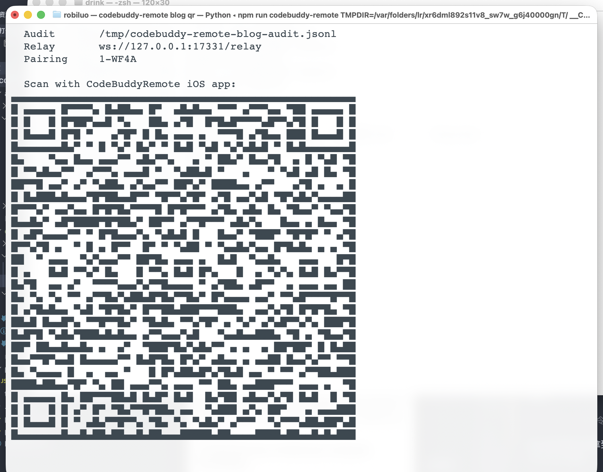
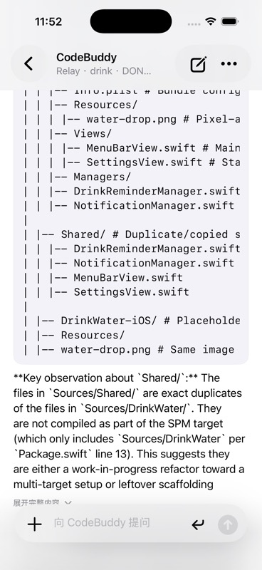
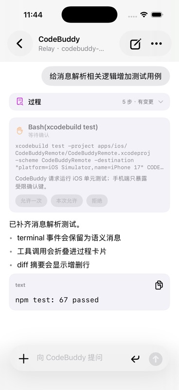
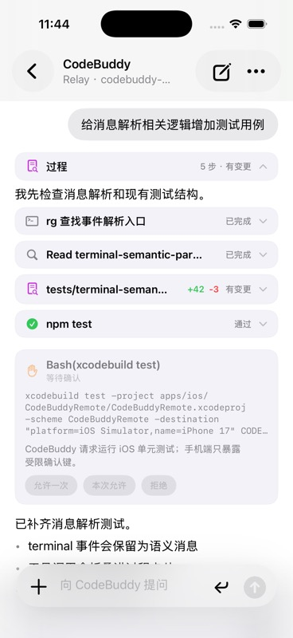

# CodeBuddy Remote：把 CodeBuddy 放进口袋

目前CodeBuddy没有远程控制端, 实现其实很普通：在 Mac 上进到项目目录，比如 `/Users/robiluo/aicoding/drink`，启动 Relay，再执行一条 `codebuddy-remote`：

```sh
npm run start:relay
cd /Users/robiluo/aicoding/drink
CODEBUDDY_REMOTE_RELAY_URL=ws://127.0.0.1:17330/relay codebuddy-remote
```

上面是本机演示命令。实际使用时，Relay 会部署在外网服务器上，Mac 端把 `CODEBUDDY_REMOTE_RELAY_URL` 换成公网 Relay 地址，例如 `wss://relay.example.com/relay`；iOS App 也连同一个 Relay。

终端里启动的还是那个熟悉的 CodeBuddy CLI，只是旁边多了一条手机可用的控制通道。`codebuddy-remote` 会打印 pairing code、Pairing URL 和二维码；真机可以扫码绑定，模拟器可以用 `xcrun simctl openurl booted` 打开同一条 Pairing URL。

下面是本机真实 Terminal 窗口里启动 `codebuddy-remote` 的画面。截图里能看到 workspace 相关路径、Relay 地址、pairing code 和二维码；二维码承载的是短期 `cbr://pair?...` Pairing URL。



手机扫完码打开 App 后，就可以直接输入：

```text
分析当前项目架构
```

下面这张图是这条 prompt 的真实输出。App 已经通过 Relay 连上 Mac host，Host 侧接的是本地 CodeBuddy session；截图里能看到 CodeBuddy 返回的目录和文件列表。



Mac 这边继续显示原来的 TUI，手机这边能看到分析过程和最后回复。如果中途需要审批，我可以在手机上点一个受限的控制键；如果回到电脑前，也可以继续在 Mac 终端里操作。

等 CodeBuddy 给出模块关系、风险点和建议以后，还可以继续追一条更具体的：

```text
给消息解析相关逻辑增加测试用例
```

如果 CodeBuddy 需要执行测试或修改文件，Mac 仍然是实际执行端。手机端看到的是测试结果、diff 摘要和最终说明，而不是原始 TUI 的每一次刷新。下面两张是 App 真实运行时的消息展示状态：折叠态可以同时看到用户消息、过程摘要、权限确认卡片、assistant Markdown 和代码块输出；展开态可以看到命令、读取文件、diff 摘要和测试结果分别以不同卡片显示。





或者在确认改动没问题后，直接让它收尾：

```text
提交并推送这次改动
```

这些指令最终都会进入 Mac 上同一个 CodeBuddy session。区别只是我不必一直坐在电脑前看终端滚动。手机上看到的是更适合移动端的消息：用户输入、助手回复、工具调用过程、测试结果、diff 摘要，以及需要审批时的受限控制入口。

这就是 CodeBuddy Remote 想解决的问题。目标很窄：给 Mac 上已经存在的 CodeBuddy session 加一个移动端入口。源码、登录态和本地权限都留在 Mac 上。iOS 负责看消息、发 prompt、处理少量受限控制；Relay 只转发加密消息，不接触源码，也不读 prompt 正文。

## 当前架构

这里最容易走偏的一步，是把手机端 prompt 直接翻译成一次 `codebuddy -p` 调用。那样实现简单很多，但产品体验完全不是一回事。

`codebuddy -p` 更像一次短任务：发进去一段 prompt，等它吐出结果。CodeBuddy Remote 要接的是另一个东西：一个已经在项目目录里跑起来的长期 session。这里有前面的对话、当前 TUI 状态、本机登录态，也会在该停下来等权限时停下来。手机端如果绕开它另起进程，表面上也能问问题，但等于把最有价值的现场丢掉了。

所以现在的链路是这样：

```text
iOS App
  <-> Relay WebSocket + device HMAC + encrypted payload
  <-> Mac codebuddy-remote
  <-> Local Host
  <-> TerminalCliAdapter
  <-> 本地长期驻留 codebuddy CLI
```

用户在目标项目里执行 `codebuddy-remote`。这件事等价于在该目录启动一个长期驻留的 `codebuddy` CLI，只是旁边多了一条手机可用的控制通道。

Mac 终端仍然保留原始 CodeBuddy CLI 界面。你可以继续在 Mac 上看 TUI、按键、审批。iOS 发出的 prompt 会写进同一个 CLI session，而不是创建一个新的短进程。

iOS 端也不再展示原始 TUI 屏幕。之前直接把 terminal output 搬到手机上，效果很差：ANSI 控制字符、重复刷新帧、屏幕布局都会把移动端体验拖垮。现在的做法是先把 CLI 输出解析成 normalized events，再由 iOS 按自己的消息结构展示。

## 为什么统一走 Relay

Local 直连一开始看起来最简单，但真机使用时很快会撞上网络现实。手机可能在 5G、公司 Wi-Fi、家庭网络、热点之间切换，Mac 又通常没有公网 IP。让 App 在这些环境里直接找到 Mac，本身就会变成另一个产品。

统一 Relay 模式以后，App 只需要连一个固定入口，Mac host 也只需要主动连 Relay。这样不会把 Mac 的 HTTP 端口暴露出去，也不用在用户路由器上做端口映射。

实际部署时，这个 Relay 应该放在外网可访问的位置，比如一台云服务器或边缘服务上。Mac host 从内网主动建立 WebSocket 连接到 Relay，iOS App 不管在 5G、公司 Wi-Fi 还是家里 Wi-Fi，也都只需要连这个公网 Relay。Relay 负责把同一个 pairing code 下的 Mac 和 iOS 路由到一起，但不负责执行任务，也不应该看到业务正文。

这里的 Relay 不是通用内网穿透。它只处理 CodeBuddy Remote 的 WebSocket 协议，而且正式业务 payload 只接受：

```json
{
  "type": "encrypted",
  "version": 1,
  "alg": "P256-HKDF-SHA256-CHACHA20-POLY1305",
  "seq": 1,
  "nonce": "...",
  "ciphertext": "..."
}
```

旧的明文 `command`、`event`、`response` 兼容路径已经移除。Relay 还能看到路由元数据、连接状态、frame 尺寸和频率，但看不到 prompt、terminal output、diff 或 assistant response 正文。

## Mac 端实现

Mac 端入口是 `codebuddy-remote`，主要代码在：

```text
apps/local-host/src/cli/codebuddy-remote.mjs
apps/local-host/src/host/local-host.mjs
apps/local-host/src/session/session-command-workflow.mjs
apps/local-host/src/adapters/terminal-cli-adapter.mjs
apps/local-host/src/terminal/terminal-semantic-parser.mjs
apps/local-host/src/relay/relay-client.mjs
apps/local-host/src/relay/relay-e2e.mjs
```

`TerminalCliAdapter` 负责启动 `codebuddy`，并把 iOS 传来的 prompt 写入同一个长期进程。Local Host 在 Mac 内部提供 HTTP/SSE 控制面，Session Command Workflow 把外部 command 统一转成安全范围内的 session 行为。

目前已经产品化的命令包括：

```text
listSessions
listEvents
sendPrompt
sendTerminalInput
interrupt
resume
getState
```

`sendTerminalInput` 被限制为审批控制键，比如 `1`、`2`、`3`、`y`、`n`、`q`。手机不能发送任意 shell 命令，也不能读写本地任意文件。

事件侧会按 `seq` 编号，支持 `listEvents` 窗口查询和断线重连回放。Mac 端只持久化语义事件，不保存原始 TUI 刷新帧：

```text
~/.codebuddy-remote/history/<workspace>-<sha256(cwd).前16位>.jsonl
~/.codebuddy-remote/devices.json
~/.codebuddy-remote/audit/<workspace>-<sha256(cwd).前16位>.jsonl
```

这个取舍很实用。原始终端帧对恢复手机聊天没有太大价值，还会很快撑大历史文件。语义事件更适合移动端恢复，也更容易做性能控制。

## 配对和安全

Mac host 启动后会打印 pairing code、Pairing URL 和二维码。真机可以扫码，模拟器可以用 deep link：

```sh
xcrun simctl openurl booted 'cbr://pair?...'
```

Pairing URL 只生成 `mode=relay`。iOS 如果扫到旧的 Local URL，会直接拒绝。

首次绑定时，iOS 会生成：

```text
deviceId
deviceSecret
deviceName
```

`deviceSecret` 存在 Keychain。Relay pairing secret 只短期有效，绑定成功后，设备可以用 device HMAC 重新加入，不需要一直依赖二维码里的短期 secret。Relay 还做了 join nonce replay cache，同一个 nonce 在窗口内不能重放。

Mac 和 iOS 在 join 阶段交换临时公钥，业务通道使用：

```text
P-256 KeyAgreement -> HKDF-SHA256 -> ChaCha20-Poly1305
```

这里没有把 Relay 说成神秘黑盒。它仍然负责路由，只是不应该碰正文。内容加密交给 Mac 和 iOS。

## iOS 端实现

iOS 工程在：

```text
apps/ios/CodeBuddyRemote/CodeBuddyRemote.xcodeproj
```

App 端现在按移动聊天产品的方式展示，不复刻终端窗口。

消息模型大致分成几类：

```text
user message
assistant markdown
activity group
tool output
permission
diff
error
```

工具调用和中间过程完成后会折叠成活动组，点开后还能看细节。这样长任务不会把屏幕刷成一串工具日志。正文按 Markdown 展示，代码块和树形输出会进入独立的 plain text 区域，避免中文段落和 monospace 内容挤在一起。

输入框也按手机习惯重做过：默认单行，支持显式换行，`+` 可以展开相机、照片、文件和插件入口。右侧不再放语音按钮，避免把当前产品误导成语音助手。

历史消息这块也做了压力测试。模型层覆盖了 1200 条消息的构建和性能回归。UI 不靠裁剪真实历史来保命，而是在展示层控制可见 entries，让长历史恢复和滚动都更稳。

## 已验证内容

Node 测试覆盖了 Relay、Local Host、协议、终端语义解析、真实 CLI adapter 对照和 terminal adapter 行为：

```sh
npm test
```

iOS 单元测试覆盖聊天模型、消息压缩、活动折叠和长历史性能：

```sh
xcodebuild test \
  -project apps/ios/CodeBuddyRemote/CodeBuddyRemote.xcodeproj \
  -scheme CodeBuddyRemote \
  -destination 'platform=iOS Simulator,name=iPhone 17' \
  CODE_SIGNING_ALLOWED=NO
```

最近一次完整验证结果是：Node 侧 67 个测试通过，iOS 侧 13 个测试通过。演示截图使用的是本地真实运行画面：Mac 端启动 `codebuddy-remote` 打印二维码，App 端在模拟器中运行并渲染消息列表。

## 还没急着做的事

还有几件事我没有急着塞进去。

真实 CodeBuddy permission 的结构化映射还要继续观察。现在手机端可以用受限 `sendTerminalInput` 处理审批键，但 `approveTool`、`rejectTool` 这种结构化命令要等真实 CLI 行为更稳定后再产品化。

审计日志已经有 JSONL 文件和导出 API，但还没有独立可视化页面。后面可以做成 Mac 管理页，或者在 iOS 设置里只读查看。

Relay 目前只隐藏正文，不隐藏流量特征。它仍然知道哪个 pairing code 有连接、frame 大小是多少、发送频率如何。如果以后要做更强的隐私保护，需要再评估 padding、批处理或者更复杂的传输策略。

## 小结

CodeBuddy Remote 现在的方向比一开始更克制：手机端不接管执行，不同步源码，不复制登录态，也不硬搬终端屏幕。

它做的是一件更窄的事：把 Mac 上那个已经存在的 CodeBuddy session，安全地接到手机上。Mac 继续负责执行和权限，iOS 负责远程对话和查看进度。这个边界简单，后续也更容易继续打磨。
