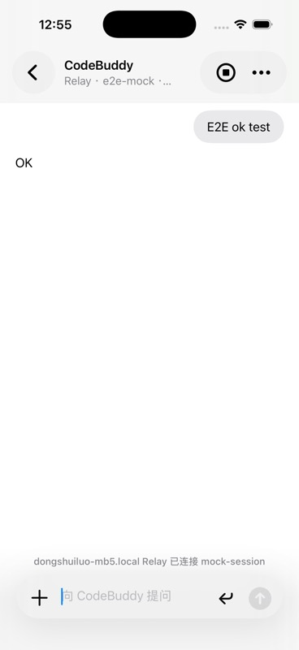
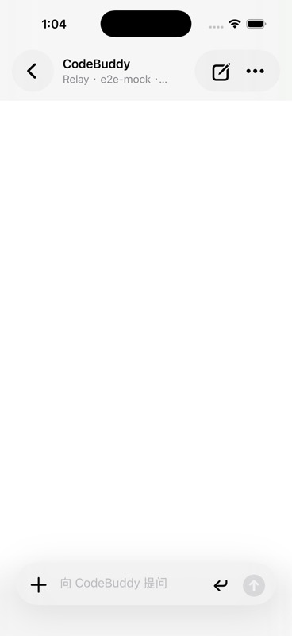

# CodeBuddy Remote：把本地 CodeBuddy session 放进口袋

我最开始想做的不是另一个 agent。

真正要解决的问题是：Mac 上已经启动的 CodeBuddy session，能不能在手机上继续对话？这个 session 已经在正确的项目目录里，已经拿到本地登录态，也会在需要时弹出权限确认。手机端不应该复制这些东西。它只需要成为一个远程控制端。

所以 CodeBuddy Remote 的边界很清楚：Mac 仍然是工作发生的地方，iOS 负责看消息、发 prompt、处理少量受限控制。Relay 负责转发加密消息，不接触源码，也不读 prompt 正文。

## 当前架构

当前链路是这样：

```text
iOS App
  <-> Relay WebSocket + device HMAC + encrypted payload
  <-> Mac codebuddy-remote
  <-> Local Host
  <-> TerminalCliAdapter
  <-> 本地长期驻留 codebuddy CLI
```

用户在目标项目里执行 `codebuddy-remote`。这件事等价于在该目录启动一个真实的、长期驻留的 `codebuddy` CLI，只是旁边多了一条手机可用的控制通道。

Mac 终端仍然保留原始 CodeBuddy CLI 界面。你可以继续在 Mac 上看 TUI、按键、审批。iOS 发出的 prompt 会写进同一个 CLI session，而不是创建一个新的短进程，也不是走 `codebuddy -p`。

iOS 端也不再展示原始 TUI 屏幕。之前直接把 terminal output 搬到手机上，效果很差：ANSI 控制字符、重复刷新帧、屏幕布局都会把移动端体验拖垮。现在做法是把 CLI 输出解析成 normalized events，然后由 iOS 按自己的消息结构展示。

## 为什么统一走 Relay

Local 直连一开始看起来最简单，但真机使用时很快会撞上网络现实。手机可能在 5G、公司 Wi-Fi、家庭网络、热点之间切换，Mac 又通常没有公网 IP。让 App 在这些环境里直接找到 Mac，本身就会变成一个产品问题。

统一 Relay 模式以后，App 只需要连一个固定入口。Mac host 也只需要主动连 Relay。这样不会把 Mac 的 HTTP 端口暴露出去，也不用在用户路由器上做端口映射。

这里的 Relay 不是通用内网穿透。它只处理 CodeBuddy Remote 的 WebSocket 协议，而且正式业务 payload 只接受：

```json
{
  "type": "encrypted",
  "version": 1,
  "alg": "P256-HKDF-SHA256-CHACHA20-POLY1305",
  "seq": 1,
  "nonce": "...",
  "ciphertext": "..."
}
```

旧的明文 `command`、`event`、`response` 兼容路径已经移除。Relay 能看到路由元数据、连接状态、frame 尺寸和频率，但看不到 prompt、terminal output、diff 或 assistant response 正文。

## Mac 端实现

Mac 端入口是 `codebuddy-remote`，主要代码在：

```text
apps/local-host/src/codebuddy-remote.mjs
apps/local-host/src/local-host.mjs
apps/local-host/src/session-command-workflow.mjs
apps/local-host/src/terminal-cli-adapter.mjs
apps/local-host/src/relay-client.mjs
apps/local-host/src/relay-e2e.mjs
```

`TerminalCliAdapter` 负责启动真实 `codebuddy`，并把 iOS 传来的 prompt 写入同一个长期驻留进程。Local Host 在 Mac 内部提供 HTTP/SSE 控制面，Session Command Workflow 把外部 command 统一转成安全范围内的 session 行为。

目前已经产品化的命令包括：

```text
listSessions
listEvents
sendPrompt
sendTerminalInput
interrupt
resume
getState
```

`sendTerminalInput` 被限制为审批控制键，比如 `1`、`2`、`3`、`y`、`n`、`q`。手机不能发送任意 shell 命令，也不能读写本地任意文件。

事件侧会按 `seq` 编号，支持 `listEvents` 窗口查询和断线重连回放。Mac 端只持久化语义事件，不保存原始 TUI 刷新帧：

```text
~/.codebuddy-remote/history/<workspace>-<sha256(cwd).前16位>.jsonl
~/.codebuddy-remote/devices.json
~/.codebuddy-remote/audit/<workspace>-<sha256(cwd).前16位>.jsonl
```

这个取舍挺实用。原始终端帧对恢复手机聊天没有太大价值，还会把历史文件撑得很快。语义事件更适合移动端恢复，也更容易做性能控制。

## 配对和安全

Mac host 启动后会打印 pairing code、Pairing URL 和二维码。真机可以扫码，模拟器可以用 deep link：

```sh
xcrun simctl openurl booted 'cbr://pair?...'
```

Pairing URL 只生成 `mode=relay`。iOS 如果扫到旧的 Local URL，会直接拒绝。

首次绑定时，iOS 会生成：

```text
deviceId
deviceSecret
deviceName
```

`deviceSecret` 存在 Keychain。Relay pairing secret 只短期有效，绑定成功后，设备可以用 device HMAC 重新加入，不需要一直依赖二维码里的短期 secret。Relay 还做了 join nonce replay cache，同一个 nonce 在窗口内不能重放。

Mac 和 iOS 在 join 阶段交换临时公钥，业务通道使用：

```text
P-256 KeyAgreement -> HKDF-SHA256 -> ChaCha20-Poly1305
```

这不是为了把 Relay 伪装成什么神秘黑盒。它只是把职责拆干净：Relay 负责路由，Mac 和 iOS 负责内容加密。

## iOS 端实现

iOS 工程在：

```text
apps/ios/CodeBuddyRemote/CodeBuddyRemote.xcodeproj
```

App 端现在按移动聊天产品的方式展示，而不是复刻终端。

消息模型大致分成几类：

```text
user message
assistant markdown
activity group
tool output
permission
diff
error
```

工具调用和中间过程完成后会折叠成活动组，点开后还能看细节。这样长任务不会把屏幕刷成一串工具日志。正文按 Markdown 展示，代码块和树形输出会进入独立的 plain text 区域，避免中文段落和 monospace 内容挤在一起。

输入框也按手机习惯重做过：默认单行，支持显式换行，`+` 可以展开相机、照片、文件和插件入口。右侧不再放语音按钮，避免把当前产品误导成语音助手。

历史消息这块也做了压力测试。模型层覆盖了 1200 条消息的构建和性能回归。UI 不再靠裁剪真实历史来保命，而是在展示层控制可见 entries，让长历史恢复和滚动都更稳。

## 演示流程

本机调试时，先启动 Relay：

```sh
npm run start:relay
```

然后在目标项目目录启动 Mac host：

```sh
cd /Users/robiluo/aicoding/drink
CODEBUDDY_REMOTE_RELAY_URL=ws://127.0.0.1:17330/relay codebuddy-remote
```

终端会启动真实 `codebuddy` CLI，并打印二维码和 Pairing URL。真机扫码即可绑定；模拟器用 `xcrun simctl openurl booted` 打开同一条 Pairing URL。

下面这张图来自一次实际 E2E 验证。Relay 和 iOS App 走的是真链路，Host 用的是测试用 `MockCliAdapter`，用来确认 pairing、加密转发、`sendPrompt`、response 展示和历史回放都能跑通。



这次 E2E 里，iOS 发出 `E2E ok test`，Host 返回 `OK`。Mac 侧日志确认收到了 `listSessions`、`listEvents` 和 `sendPrompt`。断开重连后，iOS 还能从事件历史里恢复这两条消息。

断开状态下，App 不再在会话区塞一个蓝色连接按钮。连接入口放在顶部菜单和配置页里，主界面保持干净：



## 已验证内容

Node 测试覆盖了 Relay、Local Host、协议、终端语义解析、真实 CLI adapter 对照和 terminal adapter 行为：

```sh
npm test
```

iOS 单元测试覆盖聊天模型、消息压缩、活动折叠和长历史性能：

```sh
xcodebuild test \
  -project apps/ios/CodeBuddyRemote/CodeBuddyRemote.xcodeproj \
  -scheme CodeBuddyRemote \
  -destination 'platform=iOS Simulator,name=iPhone 17' \
  CODE_SIGNING_ALLOWED=NO
```

最近一次完整验证结果是：Node 侧 67 个测试通过，iOS 侧 13 个测试通过。额外跑过一次 Relay 到 Mock Host 再到 iOS 的 E2E，确认 App 能发送消息、收到结果，并在重连后恢复历史。

## 还没急着做的事

还有几件事不适合现在硬塞进去。

真实 CodeBuddy permission 的结构化映射还要继续观察。现在手机端可以用受限 `sendTerminalInput` 处理审批键，但 `approveTool`、`rejectTool` 这种结构化命令要等真实 CLI 行为更稳定后再产品化。

审计日志已经有 JSONL 文件和导出 API，但还没有独立可视化页面。这个可以后面做成 Mac 管理页，或者在 iOS 设置里只读查看。

Relay 目前只隐藏正文，不隐藏流量特征。它仍然知道哪个 pairing code 有连接、frame 大小是多少、发送频率如何。如果以后要做更强的隐私保护，需要再评估 padding、批处理或者更复杂的传输策略。

## 小结

CodeBuddy Remote 现在的方向比一开始更克制：不做手机 agent，不同步源码，不复制登录态，也不把终端屏幕硬搬到 iPhone 上。

它做的是一件更窄的事：把 Mac 上那个已经存在的 CodeBuddy session，安全地接到手机上。Mac 继续负责执行和权限，iOS 负责远程对话和查看进度。这个边界简单，后续也更容易继续打磨。
